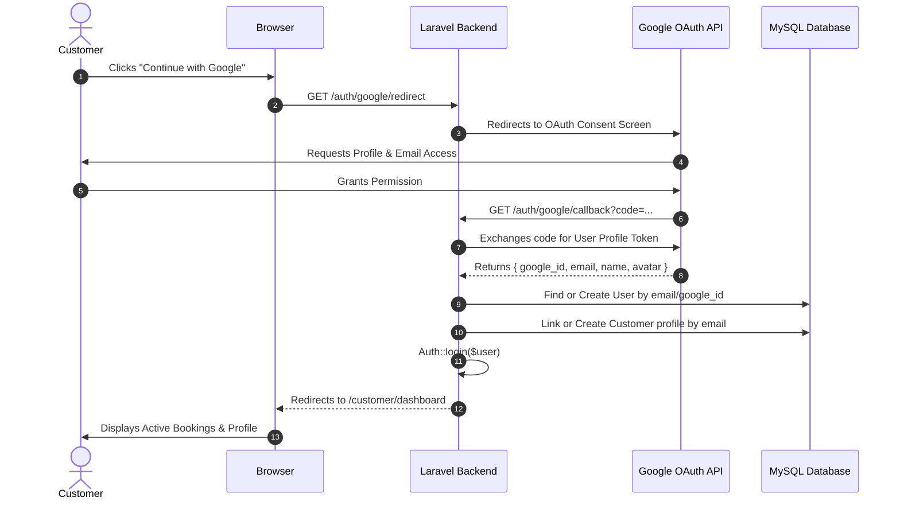

# 06. Authentication & User System Audit

## 1. Current Authentication Architecture

The application currently has two separate user-related entry points:

```
+----------------------------------------------------------------------------------------------------+
|                                    EXISTING AUTHENTICATION FLOWS                                   |
+----------------------------------------------------------------------------------------------------+
|                                                                                                    |
|  [ Flow 1: Admin Authentication ]                                                                  |
|  GET /admin/login  -->  POST /admin/login  -->  AdminAuthController@login  -->  AdminMiddleware    |
|                                                                           -->  /admin/dashboard    |
|                                                                                                    |
|  [ Flow 2: Customer Registration ]                                                                 |
|  GET /register     -->  POST /register     -->  RegisterController@register  -->  Auto-login       |
|                                                                           -->  Redirect to /booking|
|                                                                                                    |
+----------------------------------------------------------------------------------------------------+
```

### 1. Admin Authentication (`AdminAuthController.php`)
* Handled by [AdminAuthController.php](file:///Applications/XAMPP/xamppfiles/htdocs/artizen/artizen/app/Http/Controllers/Admin/AdminAuthController.php).
* Supported by [AdminMiddleware.php](file:///Applications/XAMPP/xamppfiles/htdocs/artizen/artizen/app/Http/Middleware/AdminMiddleware.php).
* Dual session validation:
  1. Standard Laravel `Auth::check() && Auth::user()->isAdmin()`
  2. Fallback session flag `session('admin_logged_in') === true`
* Logout destroys session tokens and redirects to `/admin/login`.

### 2. User Registration (`RegisterController.php`)
* Handled by [RegisterController.php](file:///Applications/XAMPP/xamppfiles/htdocs/artizen/artizen/app/Http/Controllers/Auth/RegisterController.php).
* Form fields: `name`, `email`, `password`, `password_confirmation`.
* Password is encrypted using `Hash::make()` with minimum 8-character validation.
* Upon registration, user is logged in via `Auth::login($user)` and redirected directly to `/booking`.

---

## 2. Gaps & Missing Capabilities in Current User System

| Capability | Status | Analysis & Missing Implementation |
| :--- | :--- | :--- |
| **Customer Login Page** | **Missing** | There is no `/login` route for customers. The only login route is `/admin/login`. Returning registered customers have no way to log in without re-registering. |
| **Google Sign-In / OAuth** | **Not Implemented** | `laravel/socialite` is not installed in `composer.json`. No Google API client ID or redirect URI is configured. |
| **Customer Dashboard** | **Not Implemented** | No route or view exists for authenticated customers to view their active bookings, past invoices, or profile details. |
| **User $\leftrightarrow$ Customer Table Separation** | **Partially Disconnected** | `users` table stores login credentials (`email`, `password`, `is_admin`), while `customers` table stores CRM phone numbers, addresses, and spend data. They are not linked by a `user_id` foreign key. |
| **Password Reset / Forgot Password** | **Not Implemented** | No password reset routes, tokens, or email dispatch channels exist. |
| **Email Verification** | **Not Implemented** | `MustVerifyEmail` interface on `User` model is commented out. |

---

## 3. Blueprint for Implementing Google Sign-In & Customer Dashboard

To fulfill the planned future functionality without breaking existing admin auth, the following architecture should be prepared:



### Required Architectural Enhancements:
1. **Schema Migration for Socialite**:
   * Add `google_id` (`VARCHAR(255)`, nullable, indexed) to `users` table.
   * Add `avatar` (`TEXT`, nullable) to `users` table.
   * Add `user_id` (`foreignId('user_id')->nullable()->constrained('users')`) to `customers` table.
2. **Install & Configure Socialite**:
   * Add `laravel/socialite` to dependencies.
   * Configure Google client credentials in `config/services.php` via `.env`.
3. **Dedicated Customer Middleware & Guards**:
   * Create `CustomerMiddleware` to protect `/customer/*` routes while keeping `/admin/*` segregated.
4. **Customer Portal Views**:
   * Customer Profile & Address Book.
   * My Bookings list (with live status synchronizer matching `/track-booking`).
   * One-click Re-book / WhatsApp Support trigger.
