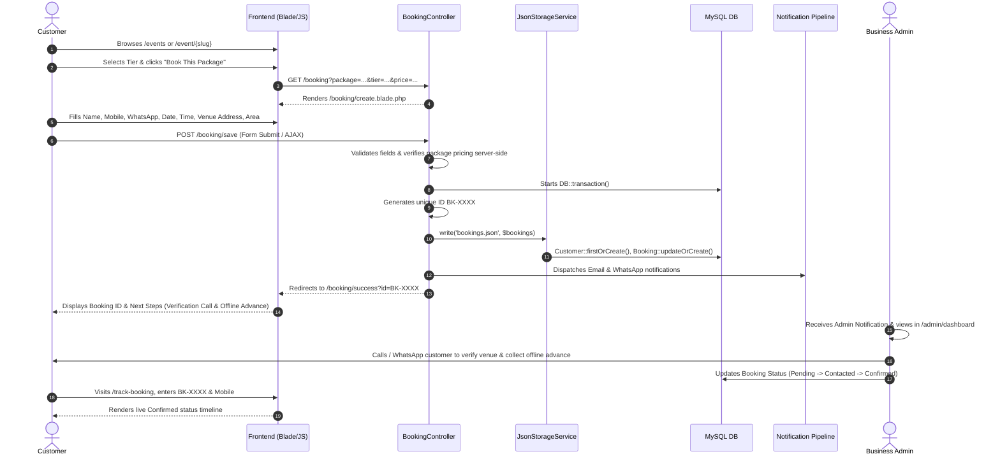

# 07. Service Enquiry & Booking Flow Technical Audit

## 1. End-to-End Existing Booking Lifecycle

The complete lifecycle from user discovery to admin fulfillment is mapped below:

---

## 2. Form Fields & Data Capturing Specification

### Booking Form (`/booking`)
* **Endpoint**: `POST /booking/save`
* **Controller**: [BookingController.php@store](file:///Applications/XAMPP/xamppfiles/htdocs/artizen/artizen/app/Http/Controllers/BookingController.php)
* **Required Captured Fields**:
  1. `name` (`string|required|max:255`): Customer full name.
  2. `mobile` (`string|required|max:20`): Calling mobile number.
  3. `whatsapp` (`string|required|max:20`): WhatsApp number for communication.
  4. `email` (`string|nullable|email`): Optional email for electronic confirmation receipt.
  5. `event_date` (`date|required|after_or_equal:today`): Celebration event date.
  6. `event_time` (`string|required`): Evening / morning time slot.
  7. `guest_count` (`integer|required|min:1|max:5000`): Expected attendees.
  8. `package` (`string|required`): Package / Tier title.
  9. `address` (`string|required|max:500`): House/venue street address.
  10. `area` (`string|required|max:255`): Indore locality (e.g. Vijay Nagar, Palasia).
  11. `landmark` (`string|nullable|max:255`): Prominent nearby landmark.
  12. `pincode` (`string|required|max:10`): Postal code.
  13. `notes` (`string|nullable`): Custom requirements / instructions.

### Server-Side Price Verification Logic
To eliminate the vulnerability of malicious clients modifying `<input type="hidden" name="price">` in developer tools, `BookingController.php` (Lines 50–74) looks up the submitted package title directly against the authorized database records (`packages.json` / MySQL `packages` + `package_tiers`) and recalculates the exact verified price before saving.

---

## 3. General Enquiry Flow (`/contact`)

* **Endpoint**: `POST /contact/send`
* **Controller**: [ContactController.php@store](file:///Applications/XAMPP/xamppfiles/htdocs/artizen/artizen/app/Http/Controllers/ContactController.php)
* **Captured Fields**: `name`, `phone`, `email`, `subject`, `message`.
* **Storage**: Generated ID format `ENQ-XXXX`, written to `enquiries` table and `enquiries.json` with status `Unread`.
* **Admin Review**: Inquiries are listed in Admin Dashboard under the **Enquiries** tab.

---

## 4. Booking Status Transitions & State Machine

| Status | Trigger / Origin | Operational Meaning | Customer Tracker Representation |
| :--- | :--- | :--- | :--- |
| **`Pending`** | Customer submission via `/booking/save` | Booking lead recorded; awaiting admin review. | Orange badge: *"Booking Request Received - Team will contact shortly."* |
| **`Contacted`** | Admin action in `/admin/dashboard` | Admin called the customer to verify address & power requirements. | Blue badge: *"Venue Verification in Progress."* |
| **`Confirmed`** | Admin action in `/admin/dashboard` | Date reserved; offline advance payment collected. | Green badge: *"Booking Confirmed - Setup Team Scheduled."* |
| **`Completed`** | Admin action in `/admin/dashboard` | Celebration setup delivered, concluded, balance collected. | Dark Green badge: *"Event Successfully Completed."* |
| **`Cancelled`** | Admin action in `/admin/dashboard` | Client requested cancellation or venue unsuitable. | Red badge: *"Booking Cancelled."* |

---

## 5. Comparison: Current Flow vs Planned WhatsApp Interactive Flow

| Workflow Step | Current Implemented Flow | Planned Future Requirement |
| :--- | :--- | :--- |
| **Submission** | Stored as `Pending` | Stored as `Pending` |
| **Admin Alert** | Email + Logged WhatsApp notification | Official WhatsApp Business API interactive message with **[Approve]** and **[Reject]** quick-action buttons |
| **Admin Decision** | Manual login to `/admin/dashboard` to click status dropdown | Admin clicks **Approve** directly inside the WhatsApp chat on mobile phone |
| **Webhook Action** | None | WhatsApp Webhook endpoint receives button click payload, verifies cryptographic signature, and triggers state change |
| **Database Sync** | Synchronous admin POST request | Automatic background event updates `bookings` table to `Confirmed` / `Cancelled` |
| **Customer Notification**| Triggered via manual admin dropdown change | Triggered automatically via WhatsApp Business API template message |
| **Customer Tracking** | Manual check on `/track-booking` | Real-time update visible in Customer Dashboard and dynamic tracker |
