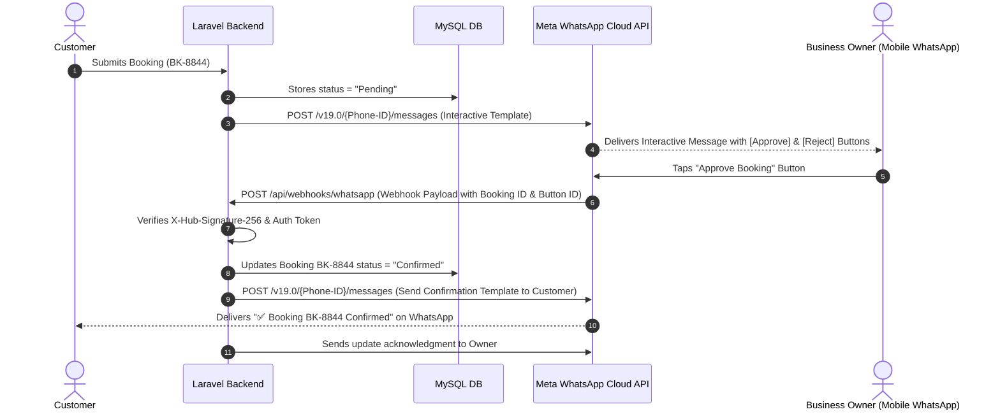

# 08. WhatsApp Integration & Interactive Automation Readiness

## 1. Existing WhatsApp Implementation Audit

```
+------------------------------------------------------------------------------------------------------+
|                                   CURRENT WHATSAPP INFRASTRUCTURE                                    |
+------------------------------------------------------------------------------------------------------+
|  1. Click-to-Chat URLs (`https://wa.me/919131668156?text=...`)                                      |
|     - Global floating widget (`resources/views/layouts/whatsapp-widget.blade.php`)                  |
|     - Package details custom quote triggers (`resources/views/events/details.blade.php`)             |
|     - Footer and Announcement Bar triggers                                                           |
|                                                                                                      |
|  2. Notification Service Class (`App\Services\WhatsAppSmsService`)                                   |
|     - Pre-formatted text message payload builders                                                     |
|     - Mock/Safe fallback when API keys are unconfigured (logs status `NOT_CONFIGURED`)               |
|     - Generic HTTP client POST stub prepared for provider webhook dispatch                          |
+------------------------------------------------------------------------------------------------------+
```

### Current WhatsApp Artifacts in Codebase
* **Phone Number Configuration**: Configured in [WhatsAppSmsService.php](file:///Applications/XAMPP/xamppfiles/htdocs/artizen/artizen/app/Services/WhatsAppSmsService.php) line 39 (`919131668156`) and fallback settings in `settings.json`.
* **Floating Widget**: Located at [resources/views/layouts/whatsapp-widget.blade.php](file:///Applications/XAMPP/xamppfiles/htdocs/artizen/artizen/resources/views/layouts/whatsapp-widget.blade.php) with pulsing animation and mobile responsiveness.

---

## 2. Technical Feasibility of Planned Interactive WhatsApp Workflow

The planned workflow involves:
`Customer Submits Booking` $\rightarrow$ `Admin receives WhatsApp Interactive Message with [Approve] / [Reject] Buttons` $\rightarrow$ `Admin taps button in WhatsApp` $\rightarrow$ `Meta Webhook hits Laravel` $\rightarrow$ `Database Status Updates to Confirmed` $\rightarrow$ `Customer receives WhatsApp confirmation`.



---

## 3. Required Components for WhatsApp Cloud API Integration

To implement this future capability securely, the following technical components must be developed:

### 1. Webhook Endpoint & Signature Verification
* **Route**: `POST /api/webhooks/whatsapp` and `GET /api/webhooks/whatsapp` (for Meta webhook challenge verification `hub.challenge`).
* **Security Middleware**: Validate `X-Hub-Signature-256` using the App Secret to prevent spoofed webhook requests.
* **Payload Parser**: Extract `entry[0].changes[0].value.messages[0].interactive.button_reply.id` (e.g. `action:approve:BK-8844`).

### 2. Message Template Pre-Approvals (Meta WhatsApp Business Manager)
Meta requires interactive business-initiated messages to use pre-approved templates:
* **Admin Notification Template (`artizen_admin_booking_alert`)**:
  * Body: `New Booking {{1}} by {{2}} for {{3}} on {{4}}. Total: ₹{{5}}`
  * Quick Reply Buttons:
    1. `APPROVE_{{1}}` (Payload: `approve:{{1}}`)
    2. `REJECT_{{1}}` (Payload: `reject:{{1}}`)
* **Customer Confirmation Template (`artizen_customer_confirmed`)**:
  * Body: `Hi {{1}}, your Artizen booking for {{2}} on {{3}} has been CONFIRMED. Advance: ₹{{4}}, Balance: ₹{{5}} (Payable Offline).`

### 3. Queue & Background Processing Architecture
* Direct HTTP calls to Meta Cloud API should be dispatched via Laravel Queued Jobs (`SendWhatsAppNotificationJob`) using Laravel's database queue driver (`php artisan queue:work`) to ensure instant page responses for customers without waiting for external API latency.

### 4. Security & Idempotency Controls
* **State Check**: Before approving via webhook, verify that the booking is in `Pending` state. If already `Confirmed` or `Cancelled`, return a polite notification to the admin preventing duplicate state transitions.
* **Replay Protection**: Store `message_id` in a cache or webhook log table to prevent replay attacks.
